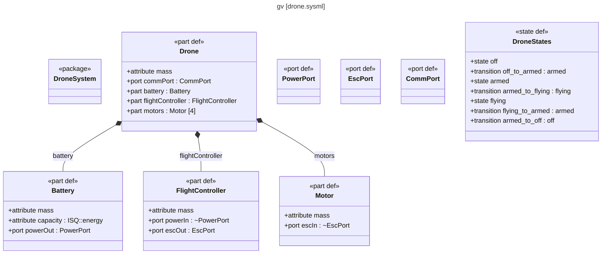
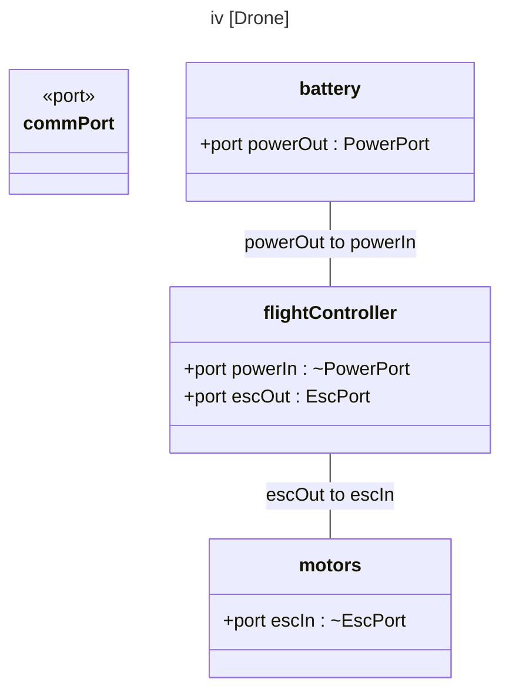
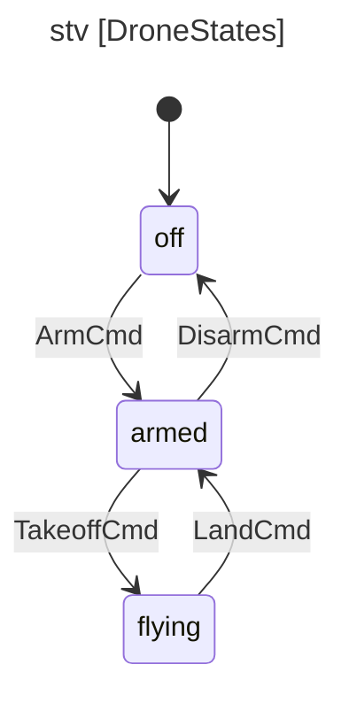

# sysml

A fast, standalone SysML v2 command-line toolchain and language server for model authoring, validation, simulation, and diagram generation.

Built on [tree-sitter](https://tree-sitter.github.io/) for reliable parsing of SysML v2 textual notation. Zero runtime dependencies — just a single binary.

Fully-qualified names resolve from the root namespace without imports, package short names (`package <LIB> 'Library Package'`) work everywhere, and values carry their units (`250 [SI::kg]`).

## Documentation

| | |
|---|---|
| [Tutorial](docs/tutorial.md) | Build a weather station model from scratch using the CLI |
| [Validation & Diagnostics](docs/validation.md) | 17 lint checks, diagnostic codes, output formats |
| [Architecture](docs/architecture.md) | Crate structure, design decisions, 3-crate workspace |
| [CI & Editor Integration](docs/ci-integration.md) | GitHub Actions workflow, LSP setup, Emacs sysml2-mode, JSON output |
| **Command references** | [Analysis](docs/commands/analysis.md) &#183; [Views](docs/commands/views.md) &#183; [Diagrams](docs/commands/diagrams.md) &#183; [Editing](docs/commands/editing.md) &#183; [Simulation](docs/commands/simulation.md) &#183; [Project](docs/commands/project.md) |

## Installation

### From source

```sh
git clone --recurse-submodules https://github.com/jackhale98/sysml-cli.git
cd sysml-cli
cargo install --path crates/sysml-cli
```

Or build manually:

```sh
cargo build --release
cp target/release/sysml ~/.local/bin/
```

The build compiles the [tree-sitter-sysml](https://github.com/jackhale98/tree-sitter-sysml) grammar from source (included as a submodule). Requires Rust 1.70+ and a C compiler (gcc or clang).

### Language server (LSP)

The `sysml-lsp` binary is a full-featured language server for SysML v2 with 19 capabilities: diagnostics, go-to-definition, find references, hover (with rollup values), contextual completions (stdlib-aware: `attribute m : ` offers `Real`/ISQ quantities ranked below workspace types, `ISQ::` lists the package members, hover resolves stdlib symbols), document outline, workspace symbols, semantic highlighting, code actions (quick-fix + add import), formatting, document highlight, folding, rename (workspace-wide), type hierarchy (advertised via LSP 3.17 typeHierarchyProvider), inlay hints, **code lens** (satisfy / verify / usage counts above each definition), and **document link** (clickable imports and super-types).

```sh
cargo install --path crates/sysml-lsp
```

Or download a prebuilt binary from [GitHub Releases](https://github.com/jackhale98/sysml-cli/releases). See [CI & Editor Integration](docs/ci-integration.md) for VS Code, Neovim, Helix, and Zed setup.

### Shell completions

```sh
sysml completions bash > ~/.local/share/bash-completion/completions/sysml
sysml completions zsh > ~/.zfunc/_sysml
sysml completions fish > ~/.config/fish/completions/sysml.fish
```

## Quick Start

Write SysML v2 as plain text in your editor of choice (there's an
[Emacs mode](https://github.com/jackhale98/sysml2-mode) and an LSP
server for everything else). The CLI is the analysis engine for the
models you write:

```sh
sysml check src/*.sysml                                          # validate (17 checks)
sysml trace --check --min-coverage 80 src/*.sysml                # requirements coverage gate
sysml rollup compute src/*.sysml --root Vehicle --attr mass      # mass budget with units
sysml simulate state-machine model.sysml -n DroneStates -e TurnOn,StartMission
sysml diagram -t iv --scope Vehicle model.sysml                  # interconnection view
```

## Highlights

### Validation that understands SysML v2 semantics

17 structural checks with root-namespace name resolution: files passed
together share a root namespace, so fully-qualified cross-file
references resolve without imports, package short names
(`package <LIB> 'Library Package'`) work everywhere, and references
into the embedded standard library are member-checked
(`ISQ::doesNotExist` warns, `ISQ::mass` resolves). Diagnostics carry
did-you-mean suggestions and machine-readable JSON output for CI. See
[Validation & Diagnostics](docs/validation.md).


### Requirements traceability

```sh
$ sysml trace requirements.sysml model.sysml
Requirement          Satisfied By         Verified By
------------------------------------------------------------
<REQ1> tempAccuracy  TemperatureSensor    TestTempAccuracy
<REQ2> opRange       WeatherStationUnit   -
<REQ3> batteryLife   PowerSupply          TestBatteryLife

Coverage: 3/3 satisfied (100%), 2/3 verified (67%)
```

Requirements modeled as usages with `<ID>` short names are first-class trace rows; satisfy/verify statements match by name, qualified name, feature chain, or `<ID>`. Look up any element by its ID with `sysml show model.sysml REQ2`.

### Attribute rollups — mass, cost, power, tolerance budgets

Compute any numeric attribute across the part hierarchy. Works for mass budgets, cost rollups, power budgets, tolerance stackups — anything with a numeric attribute:

```sh
$ sysml rollup compute model.sysml --root Vehicle --attr mass
Rollup: mass (sum) for Vehicle
  Vehicle                                   total: 900.0000
    (own)                                        20.0000
    engine : Engine       180.0000 => 180.0000 (20.0%)
    chassis : Chassis     250.0000 => 250.0000 (27.8%)
    wheels : Wheel [4]     12.5000 =>  50.0000 (5.6%)
    body : Body           400.0000 => 400.0000 (44.4%)

$ sysml rollup budget model.sysml --root Vehicle --attr mass --limit 1000
Budget: mass for Vehicle
  Total:  900.0000
  Limit:  1000.0000
  Margin: 100.0000 (10.0%)
  Status: PASS
```

Values may carry unit brackets — `attribute mass = 250 [SI::kg];` — and mixed units convert automatically (kg/g, m/mm, h/min, ...) into the root's unit, which is shown in the output.

Aggregation methods: `sum` (default), `rss` (tolerance stackups), `product`, `min`, `max`. Use `--format json` for CI integration.

**Variant configurations** (SysML v2 variations, Ch 35): select variants per variation point and compute the configured system:

```sh
$ sysml list --variants model.sysml                    # what can vary?
$ sysml rollup compute model.sysml --root Drone --attr mass \
      --variant battery=powerBattery                   # configure, then compute
```

Unselected variation points include all variants; unknown choices error with the list of available variants.

Parametric sweeps and what-if scenarios:

```sh
$ sysml rollup sweep model.sysml --root Vehicle --attr mass --param engine --from 100 --to 300 --steps 5
$ sysml rollup what-if model.sysml --root Vehicle --attr mass --scenario "light:engine=100" --scenario "heavy:engine=300"
```

### Simulate state machines and evaluate constraints

```sh
$ sysml simulate sm model.sysml -n EngineStates -e startCmd,stopCmd
State Machine: EngineStates
Initial state: off
  Step 0: off -- [startCmd]--> starting
  Step 1: starting --> running
  Step 2: running -- [stopCmd]--> stopping
  Step 3: stopping --> off

$ sysml simulate eval constraints.sysml -n PowerBudget -b consumption=450
constraint PowerBudget: satisfied
```

Parallel state regions simulate concurrently with broadcast events
(`positioning.stabilizing ----> positioning.moving`), and action flows
follow real succession semantics — forks branch, decides take exactly
one path, guards are evaluated:

```sh
sysml simulate action-flow mission.sysml -n PerformMission
sysml analyze run analysis.sysml -n MaxSpeedAnalysis -b v0=0,d=100   # solves the constraint system
```

When an analysis can't be solved, the CLI says why: `could not compute
\`vmax\` — unbound: t, vehicle.maxAcceleration` with a `-b` hint.

### Trade studies

Compare alternatives against a maximize/minimize objective:

```sh
sysml analyze trade model.sysml -n EngineTradeOff
```

### SysML v2 standard views, 4 output formats

Generate all 7 standard SysML v2 views (General, Interconnection, Action Flow, State Transition, Sequence, Grid, Browser) plus parametric, traceability, allocation, and use case — in Mermaid, PlantUML, DOT, or D2:

```sh
sysml diagram -t gv model.sysml                        # General View (definitions)
sysml diagram -t iv --scope Vehicle model.sysml         # Interconnection View (ports + connections)
sysml diagram -t stv --scope EngineStates model.sysml   # State Transition View
sysml diagram -t afv --scope ProvidePower model.sysml   # Action Flow View
sysml diagram -t sv --scope Interactions model.sysml    # Sequence View (lifelines + messages)
sysml diagram -t bv model.sysml                         # Browser View (package hierarchy)
sysml diagram -t grv model.sysml                        # Grid View (requirements matrix)
```

Legacy names still work: `bdd`=`gv`, `ibd`=`iv`, `stm`=`stv`, `act`=`afv`, `pkg`=`bv`, `req`=`grv`.

The examples below are actual CLI output for this model (`drone.sysml`):

```sysml
package DroneSystem {
    part def Drone {
        attribute mass = 1.2 [SI::kg];
        port commPort : CommPort;
        part battery : Battery;
        part flightController : FlightController;
        part motors : Motor [4];
        connect flightController.escOut to motors.escIn;
        connect battery.powerOut to flightController.powerIn;
    }
    part def Battery {
        attribute mass = 0.45 [SI::kg];
        attribute capacity : ISQ::energy;
        port powerOut : PowerPort;
    }
    part def FlightController {
        attribute mass = 0.08 [SI::kg];
        port powerIn : ~PowerPort;
        port escOut : EscPort;
    }
    part def Motor {
        attribute mass = 0.06 [SI::kg];
        port escIn : ~EscPort;
    }
    port def PowerPort;
    port def EscPort;
    port def CommPort;

    state def DroneStates {
        entry; then off;
        state off;
        transition off_to_armed
            first off accept ArmCmd then armed;
        state armed;
        transition armed_to_flying
            first armed accept TakeoffCmd then flying;
        state flying;
        transition flying_to_armed
            first flying accept LandCmd then armed;
        transition armed_to_off
            first armed accept DisarmCmd then off;
    }
}
```

**General View** — `sysml diagram -t gv drone.sysml` — definitions with their members, composition (diamond at the whole), and multiplicities:



**Interconnection View** — `sysml diagram -t iv --scope Drone drone.sysml` — the parts inside `Drone`, their ports (resolved from the part's type, `~` marking conjugated ends), and which ports each connection joins:



**State Transition View** — `sysml diagram -t stv --scope DroneStates drone.sysml` — initial state and triggered transitions:




### Query and explore

Slice the model from the shell — including by metadata (Ch 36):

```sh
sysml list --kind requirements src/*.sysml
sysml list --variants model.sysml                          # variation points (Ch 35)
sysml list --metadata Status --where status=draft src/*.sysml
sysml show model.sysml REQ2                                # look up by <ID>
sysml deps model.sysml Engine --transitive
```

Or interactively: `sysml repl` loads your project with stateful navigation:

```
sysml> cd Vehicle                          # Focus on Vehicle
sysml [Vehicle]> list                      # Show Vehicle's children
sysml [Vehicle]> usages type:Engine        # Find all Engine usages
sysml [Vehicle]> rollup mass               # Mass rollup from focused root
sysml [Vehicle]> typeof Wheel              # Where is Wheel used?
sysml [Vehicle]> subtypes                  # What specializes Vehicle?
sysml [Vehicle]> connections               # Connections involving Vehicle
sysml [Vehicle]> trace                     # Requirements traceability
sysml> usages in:Engine kind:port          # Combined filter
sysml> supertypes Sedan                    # Walk inheritance chain
sysml> check                               # Run the real lint checks
sysml> view FmeaWorksheet                  # Render a view def
sysml> analyze travelGap rss               # Run an analysis case
```

`check`, `view`, and `analyze` dispatch into the batch command
implementations (same include-path resolution, same output), so REPL
results never disagree with the CLI.

### Semantic diff — compare models, not text

```sh
$ sysml diff model-v1.sysml model-v2.sysml
  Added:   part def RainGauge :> Sensor
  Removed: attribute maxSpeed in WindSensor
  Changed: TemperatureSensor.range_max (line 42 → 45)
```

### CI gates

Every check command exits non-zero on failure, so pipelines are plain
shell (or make, or CI steps) — no runner to configure:

```sh
sysml check --severity warning src/*.sysml \
  && sysml fmt --check src/*.sysml \
  && sysml trace --check --min-coverage 80 src/*.sysml \
  && sysml coverage --check --min-score 60 src/*.sysml
```

### Scripted editing, when you need it

Models are text — your editor is the primary authoring tool. For
automation, refactoring, and CI, the editing commands operate on the
model rather than lines: `sysml rename Engine Motor --project` updates
every reference (imports, satisfies, connections) across files;
`sysml add`/`remove` insert or delete whole elements (with an
interactive wizard if you want it); `sysml fmt` formats. All emit
structured JSON envelopes under `-f json`. See
[editing commands](docs/commands/editing.md).

### Global Options

| Flag | Description |
|------|-------------|
| `-f, --format <FORMAT>` | Output format: `text`, `json` (default: `text`). All commands — including editing (`fmt`, `add`, `remove`, `rename`) — emit a structured JSON envelope under `-f json` for editor and CI integration. |
| `-q, --quiet` | Suppress summary line on stderr |
| `-I, --include <PATH>` | Additional files/directories for import resolution |
| `--stdlib-path <PATH>` | Path to the SysML v2 standard library directory (env: `SYSML_STDLIB_PATH`, config: `stdlib_path`) |

## Commands

| Command | Description | Docs |
|---------|-------------|------|
| **Analysis** | | [analysis](docs/commands/analysis.md) |
| `check` | Validate models against 17 structural rules | |
| `list` (`ls`) | List model elements with filters (`-n` name, `--doc` documentation text) | |
| `show` | Show detailed element information | |
| `trace` | Requirements traceability matrix | |
| `deps` | Dependency analysis for an element (`--transitive` for chains) | |
| `diff` | Semantic diff between two SysML files | |
| `allocation` (`alloc`) | Logical-to-physical allocation matrix | |
| `coverage` | Model quality and completeness report | |
| **Views** | | [views](docs/commands/views.md) |
| `view` | Render a model-defined view as a table (`view def` + `@TableRendering`); no name lists views | |
| **Rollups** | | |
| `rollup compute` | Aggregate any attribute over the part hierarchy (sum, RSS, min, max) | |
| `rollup budget` | Check a rollup total against a limit (CI gate) | |
| `rollup sensitivity` | Rank children by contribution to a rollup | |
| `rollup sweep` | Parametric sweep: evaluate rollup across a range of values | |
| `rollup what-if` | Compare rollup under different override scenarios | |
| **Analysis cases** | | |
| `analyze list` | List analysis cases in model files | |
| `analyze run` | Execute an analysis case; uncertainty cases propagate via `--method worst-case\|rss\|monte-carlo` (`--iterations`, `--seed`) | |
| `analyze trade` | Compare alternatives in a trade study | |
| **Diagrams** | | [diagrams](docs/commands/diagrams.md) |
| `diagram` | Generate SysML v2 standard views: gv, iv, afv, stv, sv, grv, bv (+ par, trace, alloc, ucd) | |
| **Simulation & Export** | | [simulation](docs/commands/simulation.md) |
| `simulate` (`sim`) | Evaluate constraints, state machines, action flows | |
| `export` | Export FMI 3.0, Modelica, SSP artifacts | |
| **Project** | | [project](docs/commands/project.md) |
| `init` | Initialize a `.sysml/` project | |
| `repl` | Interactive REPL with stateful navigation, relationship queries, and filtering | |
| **Editing** | | [editing](docs/commands/editing.md) |
| `fmt` | Format SysML v2 source files | |
| `rename` | Rename an element and update all references (`--project` for cross-file) | |
| `add` | Add elements to a file or stdout (flag-based or interactive) | |
| `remove` (`rm`) | Remove an element from a SysML file | |
| `doc` | Generate Markdown documentation from model structure and comments | |
| `completions` | Generate shell completion scripts | |
| **Language Server** | | [editor setup](docs/ci-integration.md#language-server-sysml-lsp) |
| `sysml-lsp` | LSP server with 19 capabilities: diagnostics, go-to-def, references, hover (with rollups), contextual completions (stdlib-aware: `attribute m : ` offers `Real`/ISQ quantities ranked below workspace types, `ISQ::` lists the package members, hover resolves stdlib symbols), outline, workspace symbols, semantic tokens, code actions, formatting, document highlight, folding, rename (workspace-wide), type hierarchy (advertised via LSP 3.17 typeHierarchyProvider), inlay hints, code lens, document link | |

## License

GPL-3.0-or-later
